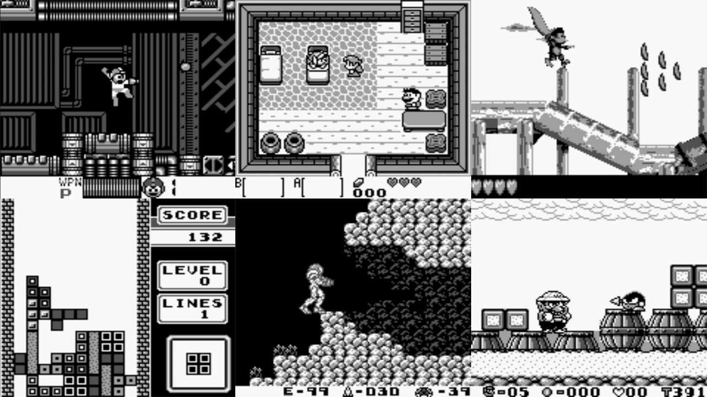
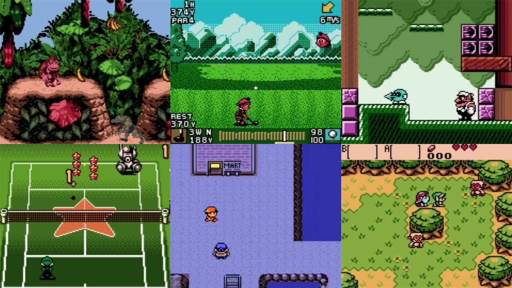

# Nintendo - Game Boy / Color (SameBoy)

### Description

SameBoy is an open source Gameboy (DMG) and Gameboy Color (CGB) emulator, written in portable C.

### License

MIT

### Icon

### Fanart

Help make me fanart!

### Screenshots

